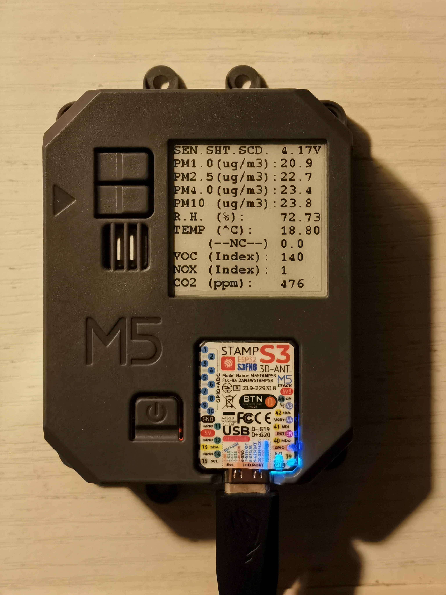

基于Sensirion传感器库的演示程序，添加水墨屏驱动（GxEPD2_BW.h）；适用于M5Stack AirQ

- CO2传感器（SCD40）的温度数据会受到其自加热的影响，应设置温度偏移，详见Sensirion SCD4x手册
- 官方硬件设计缺陷，SCD40产生的热量同时影响了SEN55的温湿度数据
- （可选）添加外部传感器（SHT4x）以获得准确的温湿度数据
- （可选）添加甲醛传感器（SFA30）以获取更多环境数据

